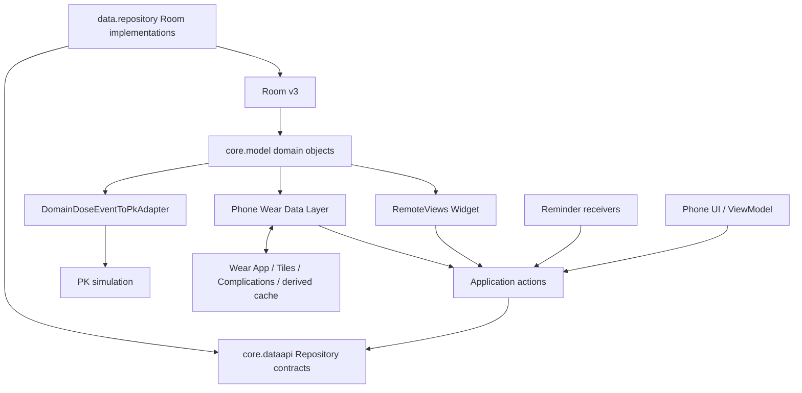
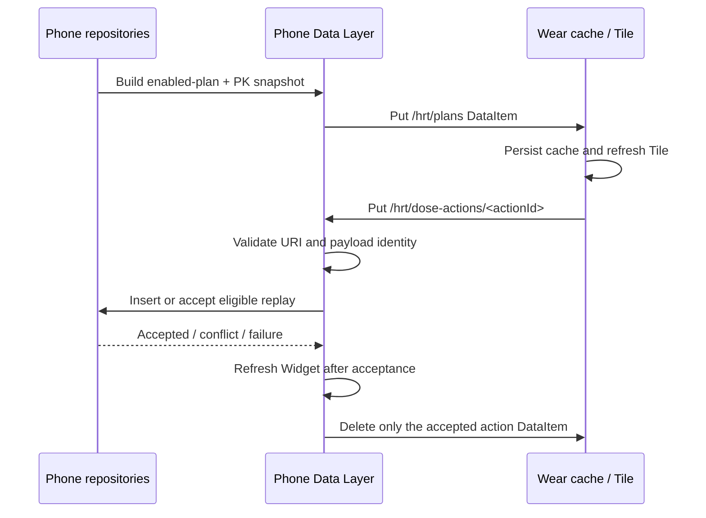

# 架构

本文描述截至 v1.6.0 的生产架构（2026-09-12 文档盘点），历史兼容路径单独标注。事实依据为 v1.6.0 tagged source、当前 main 与 [Current Status](CURRENT_STATUS.md)。

## Current v1.6 Architecture

### 模块与逻辑边界

仓库包含 `:app`、`:wear` 两个 Android application 模块和共享 JVM 模块 `:experience-core`。后者承载 occurrence、共享展示和版本化 Wear 契约；Room 实现及用药 Repository 仍在 app 内。进一步物理拆分仍是候选：

- `core.model` owns `DoseEvent`, `MedicationPlan`, `ScheduledDoseSlot` and related enums.
- `core.dataapi` owns Repository contracts and typed business results without exposing Room types.
- `data.repository` implements the contracts using Room entities, DAOs, mappings and transactions.
- `application` owns action orchestration and replay policies.
- `app` remains the composition root through `ProductionRepositoryProvider` and Android entry points.

The target dependency direction `consumer -> core.dataapi <- Room implementation` is implemented as package boundaries. Further Gradle extraction remains optional future work.

### Room v3 as source of truth

`AppDatabase` is version 3 with `exportSchema = true` and three entities: `DoseEventEntity`, `MedicationPlanEntity`, and `ScheduledDoseSlotEntity`. Schemas 2 and 3 are tracked in `app/schemas/`.

Room is the authoritative local store. Wear preferences, Widget render state and external JSON are caches or exchange formats, not competing sources of truth.

The v2-to-v3 migration:

- validates all legacy event times and plan time lists before backfill;
- adds authoritative epoch-millisecond time and domain metadata while retaining compatibility columns;
- creates stable scheduled-dose slots;
- fails and rolls back on invalid legacy values instead of guessing, clamping, or dropping records;
- is covered by migration matrices and an explicit copy-based repair tool for exceptional v2 databases.

### Domain and persistence mapping

`DoseEvent.occurredAt: Instant` is authoritative. Optional `zoneId`, `localDate`, and `slotId` express calendar and schedule context; `source`, `status`, and `revision` express origin and update semantics. `DomainDoseEventToPkAdapter` is the explicit conversion boundary to the legacy PK hour representation.

`MedicationPlan.slots` is an ordered aggregate. Each slot's `position` must match its list index and its local time has minute precision. UUIDv5 provides deterministic slot identity for migration and repeated mapping. The persisted namespace input contains the historical `io.github.yuninggu.evolune` string and is intentionally immutable for compatibility.

Room event insert distinguishes `Inserted`, `Idempotent`, `Conflict`, and `Invalid`. Updates verify the expected revision and return explicit no-change, missing, invalid, or revision-conflict outcomes. Plan saves replace plan and slots in one transaction and verify the reloaded aggregate.

### Persistence before side effects

Phone UI, reminder, Widget and Wear record actions converge on typed application actions and Repository contracts. An action is accepted only after Room insert/idempotency policy succeeds. Widget refresh, toast/notification work, DataItem acknowledgement and other platform effects happen afterward; side-effect failure does not reinterpret a committed record as unpersisted.

### Widget pipeline

The phone Widget is a RemoteViews AppWidget. `WidgetSnapshotLoader` reads enabled plans, their today's occurrences and PK events through Repository contracts, then builds a chronological responsive/scrollable snapshot with current concentration. Quick actions use a deterministic occurrence identity, validate plan and slot/date state, persist a `source=WIDGET` event with the actual click time, and only then refresh Widgets and show feedback.

There is no separate Widget database and no production DAO bypass. v1.6 registers four providers:
`EvoluneWidgetReceiver` (today plan, preserving the old component), `NextDoseWidgetReceiver`,
`CurrentE2WidgetReceiver` and `PkChartWidgetReceiver`. Each instance retains independent appearance.
Today completion is part of today plan, not a fifth picker entry. `WidgetPresentation`/`WidgetUiMapper` and
the PK chart renderer consume the shared snapshot; the 48-hour/25-point display sampling does not
change PK mathematics. Glance is not the shipped renderer.

The final next-dose widget binds its panel to OPEN_APP only; direct confirmation is available in the
today-plan widget. Phone confirmation is gated twice: presentation must be `AVAILABLE`, and the action handler checks
current availability, occurrence identity and local date again before writing. Wear App/new Tiles
retain their versioned `UPCOMING`/`DUE` confirmation contract; do not silently unify these rules.

### Wear pipeline

The legacy v1.0 path remains available for compatibility:

The Wear action ID is also the stable DoseEvent ID. A matching previously accepted Wear event is replay-safe; a collision with different source/time is a conflict. The exact action DataItem is deleted only after persistence and the accepted side effect complete. Invalid, conflicting or failed actions remain undeleted; failed deletion is retried when the DataItem is observed again.

The legacy transport above does not describe all current Wear traffic. Since v1.3,
`experience-core/.../wear/WearAppProtocol.kt` defines protocol version 1 with separate
`/hrt/v1/wear-app/snapshot` and `/hrt/v1/wear-app/request` paths. Confirmation and undo have their
own contracts and Phone handlers, producer/revision checks and replay-safe results. v1.6 adds optional
snapshot tag 11 `todaySummary`; its denominator comes from Phone's full-day occurrences, not the
truncated upcoming list (maximum five occurrences).

`WearAppStore` is a rebuildable cache. Three new Tile services and three Short Text Complication
providers consume it and share refresh coordination. The old `DoseTileService` component remains.
Each Tile has a preview resource and Evolune icon in the production manifest. Snapshot refresh is
gated by Applied; action-result refresh accepts Applied/Duplicate under the existing policy.

v1.6 skip requests use `/hrt/v1/wear-app/skip-notification`. Phone validates the exact occurrence,
persists reminder suppression in `ReminderSkipStore`, cancels the matching alarm and filters delivery
and rescheduling races. Skip does not create a DoseEvent or count as a recorded dose. This Phone-side
reminder state is not a Wear medication database.

### JSON compatibility boundary

Mahiro JSON v1 has its own DTO, codec and domain adapter. Import maps legacy hour timestamps to `occurredAt`, marks source as `JSON_V1`, applies defined defaults for metadata absent from v1, and reports per-item conflict/invalid results. Export projects domain events back to the representable v1 form and explicitly rejects unrepresentable data.

### Backup and security boundary

Phone and Wear Manifests exclude private app domains from Android Auto Backup and device transfer.
This does not disable app-controlled backup. Since v1.2, `EvoluneBackupCodec` handles a versioned
encrypted envelope; `BackupRestoreCoordinator`, B2 restore transactions/journal and `PostRestoreCoordinator`
handle preview, validation, recovery and derived-state refresh. Google Drive is a manual, explicitly
authorized `appDataFolder` provider with read-back verification and three-generation retention.
It is separate from Mahiro JSON v1 exchange and does not implement background or real-time cloud sync.

`AndroidHealthConnectWeightProvider` and `HealthConnectWeightSyncCoordinator` implement optional
foreground weight reads, with permission/provider states and local/manual freshness protection.
Neither Health Connect nor Drive becomes the authority for medication facts.

The Room database is not SQLCipher-encrypted. Release signing uses a persistent external identity and never falls back to Debug signing. Provenance and publication boundaries are recorded in [Decisions](DECISIONS.md) and [Source Provenance](../SOURCE_PROVENANCE.md).

## Future Architecture and Completed Evolution

### v1.1: Phone Widget Completion (completed)

- Existing Room/domain/repository source-of-truth architecture remains.
- Widget remains a derived presentation/action surface.
- Occurrence-driven rows, multi-slot independence, responsive/scrollable layouts and per-widget configuration are complete.
- Occurrence-scoped actions use actual click time and persistence-before-side-effects.
- Do not place the full Wear App here.

### v1.2: Google Integration & Data Continuity

Shipped as v1.2.0 on 2026-08-28. The implementation is wired from MainActivity and Settings' Sync & Backup screens.

Health Connect and Google cloud backup are separate batches:

- Health Connect reads authorized weight in the foreground; medication/PHR writes and background reads are outside the shipped scope.
- Native encrypted backup and manual Google Drive restore include validation, recovery and explicit authorization. SQLCipher and real-time cloud sync remain unimplemented.
- Health Connect and backup remain separately gated batches.

### v1.3: Wear OS Companion App

Shipped independently as v1.3.0; v1.3.1 corrected the Wear APK installation defect. These are implemented boundaries, not a future App proposal.

- Wear App consumes Phone-derived state/snapshots.
- Phone Room remains the authoritative source.
- Wear may cache last-known state; the cache is not authoritative.
- occurrence actions/undo resolve through authoritative Phone persistence.
- Keep the existing Tile alongside the App.
- Avoid creating an independent competing Wear database.

### v1.4: Onboarding / Terms / Permission Guidance

Shipped. Onboarding/tutorial state is separate from business data and is not restored as medication facts.

- presentation/platform flow;
- contextual permission requests;
- no new health-data authority.

### v1.5: Stability / Performance / Cleanup

Shipped with a recorded Energy/background owner waiver; no battery improvement is inferred from it.

Architecture changes here should be justified by measured/tested benefit, not refactoring for its own sake.

### v1.6: Widget Gallery

Shipped: four Phone providers, three new Tiles plus the compatible legacy Tile, and three Complications reuse shared presentation/domain boundaries. The [final gate](v1.6/V16_FINAL_RELEASE_GATE_2026-09-09.md) records actual evidence and product scope changes.

### v1.7: Optional CPA PK Curve

- independent CPA series;
- same chart time domain/plot area;
- separate unit semantics;
- default off;
- E2 output unaffected when off;
- scientific parameters require independent evidence/source review;
- no implementation parameter is authorized merely by being present in an external reference project.

### Deferred evolution

- Gradle module extraction may follow stable package boundaries when build/test isolation justifies it.
- Tracked Date requires a separate product decision and domain design.
- Personalized calibration and PK 2.0 require isolated scientific, provenance and regression review.
- SQLCipher requires a threat model and tested migration/key-recovery strategy.

Future work must preserve v1.0 migration compatibility, stable IDs, scoped PK attribution, sealed release history and the explicit publication boundary.
