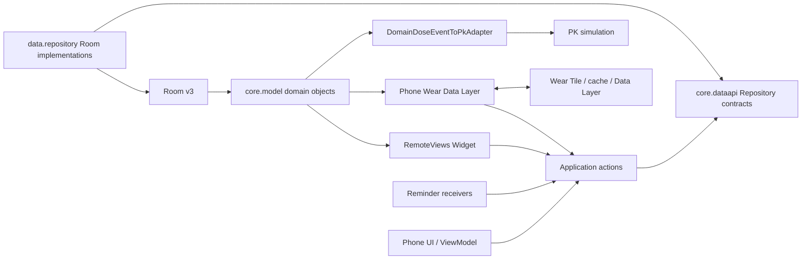
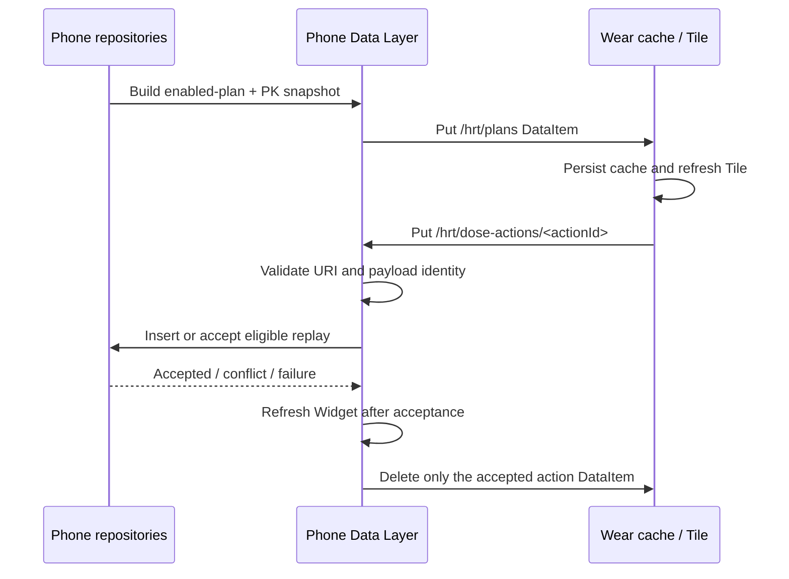

# 架构

本文区分已发布的 v1.0 架构与未来演进方向。当前事实以 `main` 的 production source、v1.0 tagged source 和 [Current Status](CURRENT_STATUS.md) 为依据。

## Current v1.0 Architecture

### 模块与逻辑边界

仓库包含 `:app` 与 `:wear` 两个 Android application Gradle 模块。v1.0 没有为每个领域创建独立 Gradle module，但已经在 `app` 内建立明确的逻辑边界：

- `core.model` owns `DoseEvent`, `MedicationPlan`, `ScheduledDoseSlot` and related enums.
- `core.dataapi` owns Repository contracts and typed business results without exposing Room types.
- `data.repository` implements the contracts using Room entities, DAOs, mappings and transactions.
- `application` owns action orchestration and replay policies.
- `app` remains the composition root through `ProductionRepositoryProvider` and Android entry points.

The target dependency direction `consumer -> core.dataapi <- Room implementation` is implemented as package boundaries. Further Gradle extraction remains optional future work.

### Room v3 as source of truth

`AppDatabase` is version 3 with `exportSchema = true` and three entities: `DoseEventEntity`, `MedicationPlanEntity`, and `ScheduledDoseSlotEntity`. Schemas 2 and 3 are tracked in `app/schemas/`.

Room is the authoritative local store. Wear preferences, Widget render state and external JSON are caches or exchange formats, not competing sources of truth.

The v2-to-v3 migration:

- validates all legacy event times and plan time lists before backfill;
- adds authoritative epoch-millisecond time and domain metadata while retaining compatibility columns;
- creates stable scheduled-dose slots;
- fails and rolls back on invalid legacy values instead of guessing, clamping, or dropping records;
- is covered by migration matrices and an explicit copy-based repair tool for exceptional v2 databases.

### Domain and persistence mapping

`DoseEvent.occurredAt: Instant` is authoritative. Optional `zoneId`, `localDate`, and `slotId` express calendar and schedule context; `source`, `status`, and `revision` express origin and update semantics. `DomainDoseEventToPkAdapter` is the explicit conversion boundary to the legacy PK hour representation.

`MedicationPlan.slots` is an ordered aggregate. Each slot's `position` must match its list index and its local time has minute precision. UUIDv5 provides deterministic slot identity for migration and repeated mapping. The persisted namespace input contains the historical `io.github.yuninggu.evolune` string and is intentionally immutable for compatibility.

Room event insert distinguishes `Inserted`, `Idempotent`, `Conflict`, and `Invalid`. Updates verify the expected revision and return explicit no-change, missing, invalid, or revision-conflict outcomes. Plan saves replace plan and slots in one transaction and verify the reloaded aggregate.

### Persistence before side effects

Phone UI, reminder, Widget and Wear record actions converge on typed application actions and Repository contracts. An action is accepted only after Room insert/idempotency policy succeeds. Widget refresh, toast/notification work, DataItem acknowledgement and other platform effects happen afterward; side-effect failure does not reinterpret a committed record as unpersisted.

### Widget pipeline

The phone Widget is a RemoteViews AppWidget. `WidgetSnapshotLoader` reads enabled plans and PK events through Repository contracts, then builds a snapshot with up to two plans and current concentration. Quick actions use a deterministic plan/minute event ID, validate plan state, persist a `source=WIDGET` event, and only then refresh Widgets and show feedback.

There is no separate Widget database and no production DAO bypass. Glance, advanced configuration and expanded privacy/size behavior are future choices, not v1.0 claims.

### Wear pipeline

The v1.0 path is deliberately small:

The Wear action ID is also the stable DoseEvent ID. A matching previously accepted Wear event is replay-safe; a collision with different source/time is a conflict. The exact action DataItem is deleted only after persistence and the accepted side effect complete. Invalid, conflicting or failed actions remain undeleted; failed deletion is retried when the DataItem is observed again.

The current `/hrt/*` DataMap/JSON transport does not yet have a general protocol version, envelope, checksum, explicit response message or cross-version negotiation. This limitation is tracked for the v1.1 gap audit.

### JSON compatibility boundary

Mahiro JSON v1 has its own DTO, codec and domain adapter. Import maps legacy hour timestamps to `occurredAt`, marks source as `JSON_V1`, applies defined defaults for metadata absent from v1, and reports per-item conflict/invalid results. Export projects domain events back to the representable v1 form and explicitly rejects unrepresentable data.

### Backup and security boundary

Phone and Wear Manifests point to version-appropriate backup rules. All private app domains are excluded from Android cloud backup and device transfer. User-controlled JSON export/import is the current migration mechanism.

The Room database is not SQLCipher-encrypted. Release signing uses a persistent external identity and never falls back to Debug signing. Provenance and publication boundaries are recorded in [Decisions](DECISIONS.md) and [Source Provenance](../SOURCE_PROVENANCE.md).

## Future Architecture

### v1.1: Wear and Widget enhancement

The first step is a Wear / Widget Gap Audit. It will establish the exact gaps in protocol versioning, offline feedback, broader Wear UI, Widget sizing/configuration/privacy and device coverage before implementation scope is locked.

Potential directions include a pure Kotlin versioned Wear protocol, explicit acknowledgements, a richer Wear experience, and improved Widget layouts. None is treated as shipped until implemented and verified.

### v1.2: external integrations

Health Connect and Google cloud backup are separate batches:

- Health Connect remains an optional adapter, initially expected to focus on explicitly authorized data such as weight. Room remains authoritative.
- Cloud backup requires a versioned encrypted format, recovery and conflict behavior, key lifecycle, explicit user authorization, and provider-specific testing before Google integration.

### Deferred evolution

- Gradle module extraction may follow stable package boundaries when build/test isolation justifies it.
- Tracked Date requires a separate product decision and domain design.
- Personalized calibration and PK 2.0 require isolated scientific, provenance and regression review.
- SQLCipher requires a threat model and tested migration/key-recovery strategy.

Future work must preserve v1.0 migration compatibility, stable IDs, scoped PK attribution, sealed release history and the explicit publication boundary.
