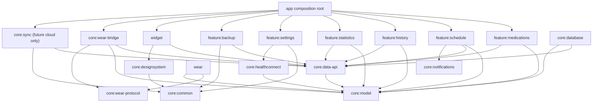
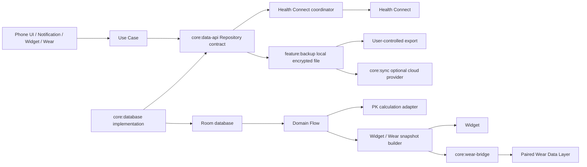
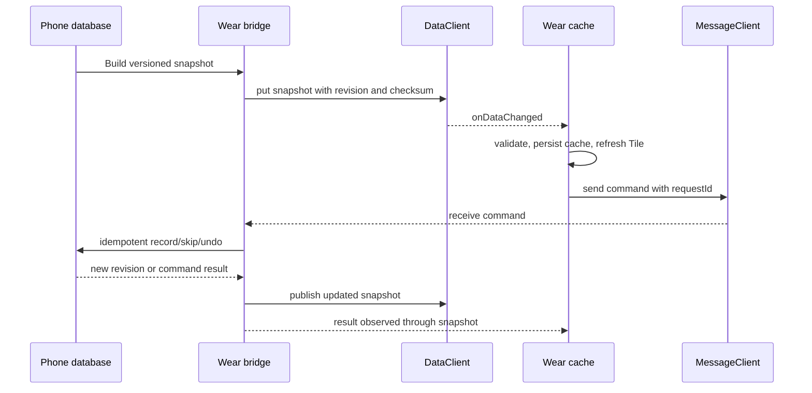

# 架构设计

## 1. 现状与目标

### 当前状态：已确认

当前仓库只有 `:app` 和 `:wear` 两个 Android application 模块。手机端的 UI、ViewModel、Repository、Room Entity、PK 模型、提醒和 RemoteViews 小组件都位于 `app`；Wear 端独立保存 Tile 状态，并通过 Google Play Services Wearable Data Layer 与手机通信。

### 目标状态：建议设计

将公共领域模型、数据库、协议和平台适配从手机 UI 中拆出。迁移以新增边界和稳定接口为主，不要求一次性重写现有 app。

## 2. 模块依赖

图中的 `core:data-api` 是目标逻辑边界，不要求 Phase 0 立即创建 Gradle module。过渡期可以先在 `app` 中建立独立 package；创建模块后，feature 只依赖 Repository contract，`core:database` 反向实现这些 contract。`app` 作为 composition root 负责把实现注入 feature、Service、Receiver 和 Worker。

### 依赖规则

- UI feature 只能通过 Use Case 和 `core:data-api` 中的 Repository contract 访问数据，禁止依赖 Room Entity、DAO 或数据库工厂。
- `core:model` 不依赖 Android、Room、Compose、Wearable 或 Health Connect。
- `core:data-api` 只依赖 `core:model`，定义 Repository contract、查询结果和事务语义，不暴露 Room 类型。
- `core:database` 依赖并实现 `core:data-api`，可以依赖 Room，禁止反向依赖 feature、Wear、Widget、Health Connect 或外部云平台。
- `core:healthconnect` 可以依赖 `core:model` 和 Health Connect SDK，不能让 Health Connect 类型渗入核心模型。
- `core:wear-protocol` 应保持纯 Kotlin/JVM 可测试，不能依赖手机 UI 或 Room。
- `core:wear-bridge` 是手机侧 Wearable Data Layer 适配器，只负责配对设备的快照、命令和连接状态；它通过 Use Case/Repository contract 访问业务能力，不直接访问 DAO。
- `wear` 依赖协议和领域 DTO，不依赖手机 `app` 的 Compose 屏幕。
- `widget` 依赖只读快照接口和动作入口，不持有独立业务数据库。
- `feature:backup` 负责用户主动触发的本地导出、恢复和恢复预览。
- `core:sync` 仅保留给未来云 provider、多设备冲突和后台同步编排，不依赖 Wearable SDK，也不承担手机与手表通信。

## 3. 模块职责

| 模块 | 职责 | 允许依赖 | 禁止依赖 | 对外接口 |
|---|---|---|---|---|
| `app` | 启动、导航、依赖组装、权限 Activity | 所有 feature 和平台模块 | 业务实现堆积在 Activity | `MainActivity`、导航入口 |
| `core:model` | 领域模型、值对象、状态和来源枚举 | Kotlin 标准库 | Android、Room、Compose | `MedicationPlan`、`DoseEvent`、`ScheduledDoseSlot` |
| `core:data-api` | Repository contract、查询结果、事务和一致性语义 | `core:model` | Android、Room、UI、云/Wear SDK | `DoseEventRepository`、`MedicationPlanRepository` contract |
| `core:database` | Room Entity、DAO、Repository 实现、schema 和迁移 | `core:data-api`、`core:model`、Room | UI、Health Connect、Wear、云 provider | Repository 实现、数据库工厂（仅 composition root 可见） |
| `core:common` | 时间、结果类型、错误、序列化辅助 | Kotlin/少量 Android 基础 | 具体 feature | `Clock`、`AppError`、序列化配置 |
| `core:designsystem` | Compose 色彩、组件、无障碍规范 | Compose、`core:common` | DAO、业务规则 | 主题和通用组件 |
| `core:notifications` | 通知、提醒调度、重排和动作分发 | `core:model`、平台 API | UI、Wear UI | `ReminderScheduler`、`NotificationActionHandler` |
| `core:healthconnect` | 权限、映射、读写同步、能力探测 | `core:model`、Health Connect | UI、Room Entity | `HealthConnectGateway`、同步结果 |
| `core:wear-bridge` | 手机侧 Data Layer、快照发布、命令接收和连接状态 | `core:data-api`、`core:model`、`core:wear-protocol`、Wearable SDK | DAO、Room Entity、云 provider、OAuth | `WearSnapshotPublisher`、`WearCommandAdapter` |
| `core:sync` | 未来云 Provider 抽象、同步状态、冲突和后台调度 | `core:data-api`、`core:common` | Wearable SDK、直接依赖 UI | `CloudSyncCoordinator`、`CloudSyncProvider` |
| `core:wear-protocol` | 版本化消息、编码、校验和兼容策略 | Kotlin 标准库 | Android UI、Room | `WearEnvelope`、Codec、MessageType |
| `feature:*` | 单一用户能力的 Use Case、状态和 UI | model、data-api、design system | DAO、Room Entity、其他 feature 的内部类 | Use Case、UiState、Screen |
| `wear` | Wear App、Tile、离线队列和动作反馈 | model DTO、wear protocol | 手机 Compose、手机 DAO | Wear UI、Data Layer adapter |
| `widget` | AppWidget/Glance provider 和配置 | model snapshot、design system | 直接写数据库业务规则 | `WidgetSnapshotProvider` |

## 4. 数据流

手机数据库保持主要事实来源。Health Connect、Wear 缓存、Widget 状态和云文件都属于派生视图或外部交换格式。

“Wear 同步”只表示已配对手机和手表之间的短距离设备传输：手机发布可重建快照，手表提交幂等命令，断连后恢复。它不涉及账户、OAuth、云存储或跨手机合并。“云同步”处理远端加密快照、账户授权、多设备冲突和删除传播；“本地备份”处理用户主动导出与恢复。三者不得共享一个含混的 `sync` 入口。

## 5. 数据库与状态管理

当前 `AppDatabase` 位于 `app/src/main/java/io/github/yuninggu/evolune/data/AppDatabase.kt`，版本 2，实体为 `DoseEventEntity` 和 `MedicationPlanEntity`。`SettingsDataStore` 存储体重、主题、颜色方案、自动检查更新和时间制式；Wear 使用 `SharedPreferences` 保存仪表盘缓存。

目标设计：

1. 继续使用 Room，不为复刻迁移包而引入 SQLCipher、Hilt 或其他大依赖。
2. 从下一次 schema 变更开始导出 Room schema，并为每一次升级添加迁移测试。
3. 使用 UTC epoch milliseconds 表示实际事件时间，使用独立 `zoneId` 和本地日期字段表达用户日历语义。
4. 逐步分离 Domain、Entity、External DTO 和 UI model。
5. 先建立手动依赖组装的接口边界；只有当模块和对象数量足以证明收益时再评估 Hilt。

## 6. 手机与手表同步时序

当前实现只完成了其中的基础路径：`DataClient` 发布计划快照，`MessageClient` 请求计划，剂量动作通过 DataItem 传回；没有统一 envelope、ack、checksum 或版本协商。

## 7. Wear 协议建议

采用 `DataClient + MessageClient` 组合：

- `DataClient`：保存小而稳定的最新快照，具备离线缓存和最终一致性，适合 Wear Tile/App 读取。
- `MessageClient`：发送短命令和刷新请求，适合快速记录、跳过、撤销和请求全量快照。
- `ChannelClient`：当前不需要。它适合长连接或大文件流，不适合少量用药事件和状态快照。

建议 envelope 至少包含：`protocolVersion`、`schemaVersion`、`messageId`、`messageType`、`deviceId`、`createdAt`、`eventId`、`baseRevision`、`payload`、`payloadChecksum`。服务端或手机端以 `(deviceId, messageId)` 记录处理结果，以 `eventId` 保障幂等。

## 8. 通知与后台任务

当前提醒使用 AlarmManager 和广播接收器，未使用 WorkManager。建议保持：精确时间提醒使用 AlarmManager，非紧急重算、Widget 刷新、Health Connect 手动/周期同步使用 WorkManager。后台任务必须可取消、可重试、可观测，并且不能把业务状态藏在 ViewModel。

## 9. Health Connect

Health Connect 是外部健康数据集成层，不是核心事实来源。第一阶段可读取用户授权的体重记录，后续再评估写入用药记录。每类数据单独开关和权限；权限撤销时保留本地数据、停止相关同步并显示降级状态。

迁移资料的 Health Connect 快照包含体重读取、PHR/FHIR MedicationStatement 写入和设置状态，但这些源码与 Evolune 当前模型、依赖和许可证边界不兼容，必须重新设计接口。

## 10. 小组件

当前 Evolune 使用 `RemoteViews`，可靠性优先。迁移包的 Glance 实现具有响应式尺寸、状态存储、配置 Activity 和后台刷新设计，适合作为行为参考。

建议先抽出 `WidgetSnapshot` 和动作接口，再以一个低风险只读小组件评估 Glance。若 Glance 在目标 OEM Launcher 上出现刷新或交互不一致，应保留 RemoteViews；“现代化”不是单独的验收目标。

## 11. 安全与可观测性

- 当前无数据库加密；SQLCipher 仅在需要明确威胁模型、密钥恢复方案和迁移预算时评估。
- `allowBackup=true` 与当前缺失备份规则是发布前必须处理的隐私事项。
- 日志禁止记录药物名称、剂量、健康值和备份明文。
- 错误应分为权限拒绝、设备不可用、数据无效、冲突、可重试网络错误和不可恢复错误。
- 生产日志只记录事件类型、结果、耗时和匿名关联 ID。

## 12. 测试

分层测试：

1. `core:model`：时间、状态、幂等键、计划槽位和 Tracked Date 纯 JVM 测试。
2. `core:database`：Room migration、DAO、Repository 和备份恢复测试。
3. `core:wear-protocol`：编码兼容、未知版本拒绝、边界长度、checksum 和重复消息测试。
4. `core:healthconnect`：权限状态、映射、去重和撤销权限测试；真实 Provider 只做设备矩阵验证。
5. Widget/Wear：snapshot builder、尺寸、离线和真实设备交互测试。
6. UI：关键状态和无障碍语义测试，不把 UI 截图测试当作唯一覆盖。
